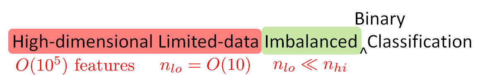
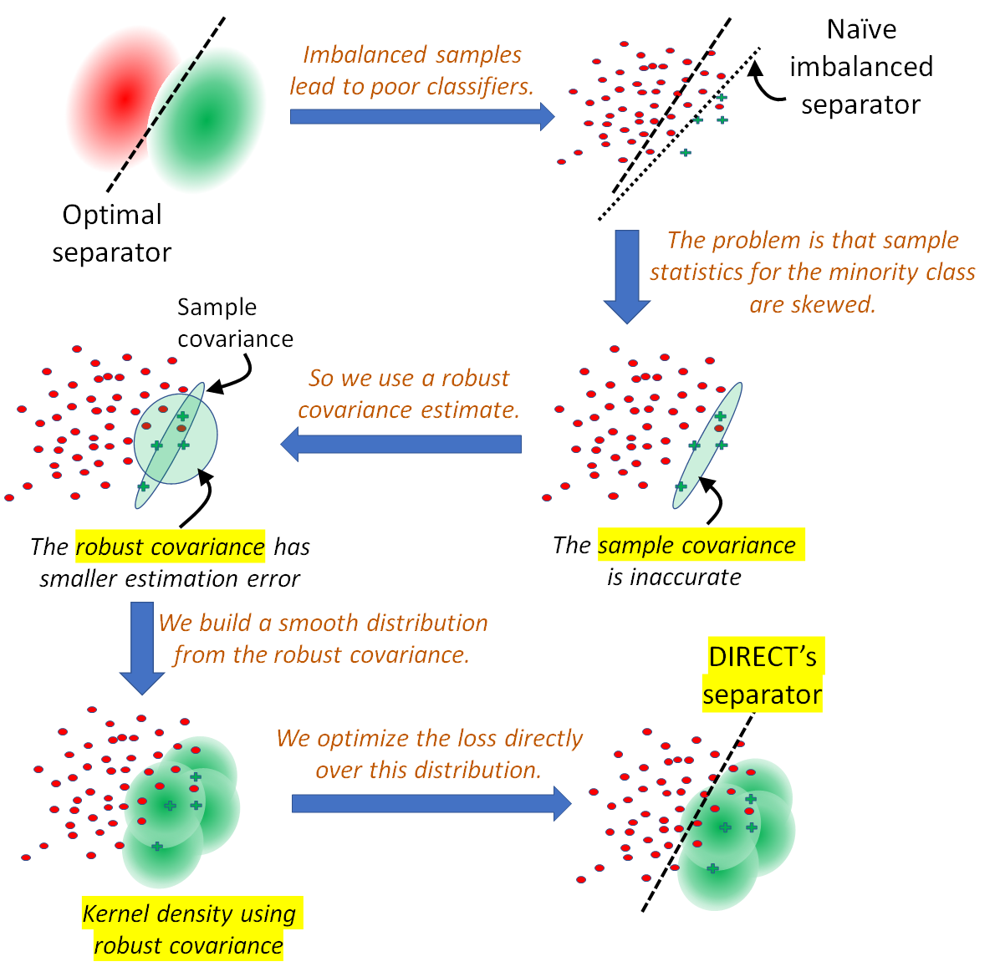

# DIRECT

  </img> 
  </img>

## Example on the Tumors dataset

The file ``Tumors_scaled.csv.gz`` contains, in each row, the tumor type (first column) and scaled gene expression data (remaining 16,063 columns) for an individual patient (http://portals.broadinstitute.org/cgi-bin/cancer/datasets.cgi).

<pre>
$ MKL_NUM_THREADS=1 python -u tests.py --dataset Tumors_scaled.csv.gz --nlo 7 --nhi 100 --max_classes 2
</pre>
This runs 
* 2 binary classifications, one for each of the first two tumor types (the data has 15 types of tumors),
* each with 7 positive examples and 100 negative examples,
* 30 repetitions of each classification experiment (default),
* using 30 processes (default).

The results show the area under the ROC curve (auc), the area under the Precision-Recall curve (aucpr), and the training and testing times for the two binary classifications.
<pre>
Namespace(dataset='Tumors_scaled.csv.gz', max_classes=2, nhi=[100], nlo=[7], num_procs=30, num_repeats=30, seed=0, use_K=False)
Tumors_scaled.csv.gz-0: n_lo=7 n_hi=100 p=16063 lo_class=1, num points in lo=11, num points in hi=187
0 1 2 3 4 5 6 7 8 9 10 11 12 13 14 15 16 17 18 19 20 21 22 23 24 25 26 27 28 29
        auc  aucpr  train_time  test_time
mean  0.910  0.335       0.225      0.005
std   0.049  0.163       0.045      0.001
50%   0.922  0.277       0.221      0.005
max   0.971  0.685       0.357      0.007
Tumors_scaled.csv.gz-1: n_lo=7 n_hi=100 p=16063 lo_class=1, num points in lo=10, num points in hi=188
0 1 2 3 4 5 6 7 8 9 10 11 12 13 14 15 16 17 18 19 20 21 22 23 24 25 26 27 28 29
        auc  aucpr  train_time  test_time
mean  0.878  0.610       0.233      0.004
std   0.085  0.223       0.032      0.001
50%   0.862  0.686       0.232      0.004
max   1.000  1.000       0.338      0.007
time taken (in secs) = 10
</pre>

If you use this code, please cite the following paper:
<pre>
Robust high-dimensional classification from few positive examples,
by D. Chakrabarti and B. Fauber,
in IJCAI 2022.
</pre>
